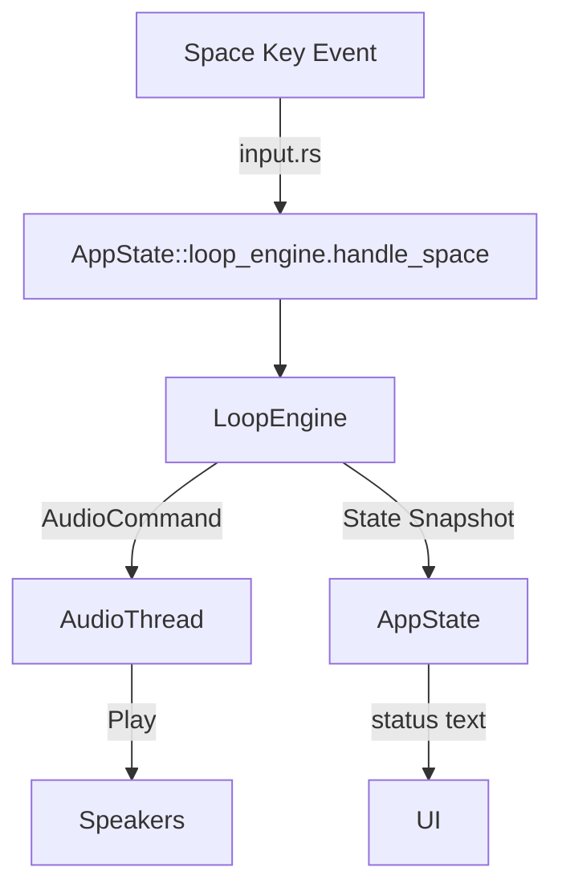

# Design – mvp-2-record-loop-track

## Overview
Implement a loop recording subsystem that extends `AppState` with a dedicated `LoopEngine`. The engine manages the `Idle → Ready → Recording → Playing` lifecycle, coordinates with the audio thread for monitoring (live pad playback) and scheduled loop playback, and retains captured loops only while they remain valid for the current BPM/bars within the running session. Input handlers (space key in Pads mode) delegate to the engine, and UI observes read-only state for minimal, scope-appropriate feedback (status text, not new widgets).

### Goals
- Deterministic timing using a mockable clock so TDD can assert lifecycle transitions and precise offsets.
- Hard-real-time safety: recording and playback must not block the audio callback or the main event loop.
- Loop retention while valid: keep captured events in memory for seamless playback, but clear them when canceled or when BPM/bars change so outdated loops never linger.

### Non-Goals (per requirements)
- No new timeline visualization or transport UI enhancements beyond existing status messaging.
- No overdubbing/multi-layer mixing beyond replaying the single captured cycle.
- No BPM/bars editing UI changes (handled by prior spec).

## Steering Document Alignment

### Technical Standards (tech.md)
- Keep audio operations asynchronous using CPAL; avoid blocking the callback thread.
- Maintain sub-10ms input-to-audio latency by continuing to send `AudioCommand::Play` for immediate monitoring.
- Pre-allocate buffers and use lock-free queues where possible to prevent XRuns.

### Project Structure (structure.md)
- Introduce `src/state/loop_engine.rs` for the new engine module, keeping `AppState` lean.
- Extend `src/audio.rs` with new commands for metronome ticks and scheduled playback, preserving modular boundaries.
- Keep loop data entirely in engine state; no new persistence helpers required.

## Code Reuse Analysis

### Existing Components to Leverage
- **`AppState`**: orchestrates mode/focus; will own a `LoopEngine` instance and expose read-only getters.
- **`AudioCommand`**: extend with `MetronomeTick` and `PlayScheduled { event_id }` variants to reuse existing audio thread infrastructure.
- **`input.rs`**: reuse event dispatch to translate Space key into engine calls.
- **`selection` & pads mapping**: reuse existing pad-to-sample mapping for monitoring playback.

### Integration Points
- **Audio thread (`audio.rs`)**: extend to handle metronome ticks (synthesized beep) and scheduled loop playback using timers or sink start offsets.

## Architecture

### LoopEngine Module
- Holds state (`LoopState`, `events`, `loop_length_ms`, `start_time`) and implements methods: `enter_ready`, `cancel_ready`, `start_recording`, `cancel_recording`, `complete_recording`, `tick_playback`.
- Depends on a `Clock` trait abstraction with `now()` returning `Instant`-like value; production implementation wraps `std::time::Instant`, tests use a fake clock.
- Communicates with audio via an injected `AudioBus` trait that wraps the `Sender<AudioCommand>` but allows mocking in tests.

### Timing & Scheduling
- During recording, `LoopEngine` records events by calling `clock.now()` and storing offsets relative to `record_start`.
- Playback scheduling occurs in the main loop: on each frame/tick, `LoopEngine::collect_due_events(now)` returns events to emit via `AudioCommand::Play` (immediate) while also scheduling future occurrences by tracking `last_cycle_start`.
- Metronome ticks are produced by generating a short synthesized beep per tick (no preloaded asset) via `AudioCommand::PlayMetronome`, using rodio primitives to create a brief sine wave or square pulse on demand.

### Loop Reset Behavior
- When BPM or bars change, the engine clears its in-memory events and returns to `Idle`, forcing a fresh recording for the new tempo context.
- On application start (AppState::new), the engine begins empty (`Idle`) with no prior loop data carried over from previous runs.

### Error Handling
- Audio command failures fall back to logging; the engine keeps state consistent.

### Modular Design Principles
- **Single Responsibility**: `LoopEngine` handles loop lifecycle and in-memory loop data; `AudioBus` handles command dispatch.
- **Component Isolation**: no UI logic in engine; UI module reads simple enums/flags.
- **Utility Modularity**: helpers like `compute_loop_length_ms(bpm, bars)` live in `loop_engine.rs` but are exported for tests.



## Components and Interfaces

### Component 1 – `LoopEngine`
- **Purpose:** Own loop lifecycle, capture events, schedule playback, maintain in-memory loop, and expose read-only state.
- **Interfaces:**
  - `fn new(clock: Box<dyn Clock>, audio: Box<dyn AudioBus>) -> Self`
  - `fn handle_space(&mut self, bpm: u16, bars: u16)` – orchestrates transitions depending on current state.
  - `fn record_event(&mut self, pad: char)` – called by input when pad triggered during recording.
  - `fn update(&mut self)` – invoked each frame to schedule playback events.
  - `fn state(&self) -> LoopState` – returns enum for UI/testing.
- **Dependencies:** `Clock`, `AudioBus`.
- **Reuses:** util functions for clamping, `AudioCommand` channel, existing pad mapping.

### Component 2 – `AudioBus` (trait + impl)
- **Purpose:** Abstract the `Sender<AudioCommand>` with non-blocking semantics and provide helpers for pad playback, synthesized metronome beeps, and scheduled events.
- **Interfaces:** `fn play_pad(&self, key: char)`, `fn play_metronome_beep(&self)`, `fn play_scheduled(&self, event: &RecordedEvent)`.
- **Dependencies:** existing audio thread; metronome beep synthesized on demand via rodio primitives (e.g., short sine burst).
- **Reuses:** new audio commands for metronome & scheduled playback, existing immediate playback path.

### Component 3 – `Clock` (trait + impl)
- **Purpose:** Provide deterministic time for engine.
- **Interfaces:** `fn now(&self) -> Duration`, `fn sleep_until(&self, instant: Duration)` (testing only).
- **Dependencies:** `std::time::Instant` in production; `FakeClock` in tests.

## Data Models

### LoopState Enum
```
pub enum LoopState {
    Idle,
    Ready { countdown_ticks_remaining: u8 },
    Recording { started_at: Duration },
    Playing { cycle_started_at: Duration },
}
```

### RecordedEvent Struct
```
pub struct RecordedEvent {
    pub pad: char,
    pub offset_ms: u32,
}
```

## Error Handling

### Error Scenarios
1. **Metronome synthesis failure**
   - **Handling:** Log warning; skip tick but keep lifecycle transitions intact.
   - **User Impact:** Performer loses the audio countdown cue, yet Ready/Recording state changes still occur.

2. **Audio channel disconnect**
   - **Handling:** Engine marks itself `Idle` and clears events to avoid replaying incomplete loops.
   - **User Impact:** Recording stops; user must restart the session.

## Testing Strategy

### Unit Testing
- Test `LoopEngine::handle_space` transitions for all states using `FakeClock` to control time.
- Verify `record_event` stores offsets correctly for varied pad timings.
- Validate metronome countdown emits four `PlayMetronome` commands at expected intervals.

### Integration Testing
- Extend `tests/app_state_tests.rs` with scenarios: pressing Space sequences states and interacts with `AudioBusMock`.
- Integration test using `spawn_audio_thread` mocked by channel to confirm scheduled playback commands align with offsets.

### End-to-End Testing
- Add TUI test workflow (using @microsoft/tui-test) that simulates: enter Pads, press Space, trigger pads, wait for loop playback.

