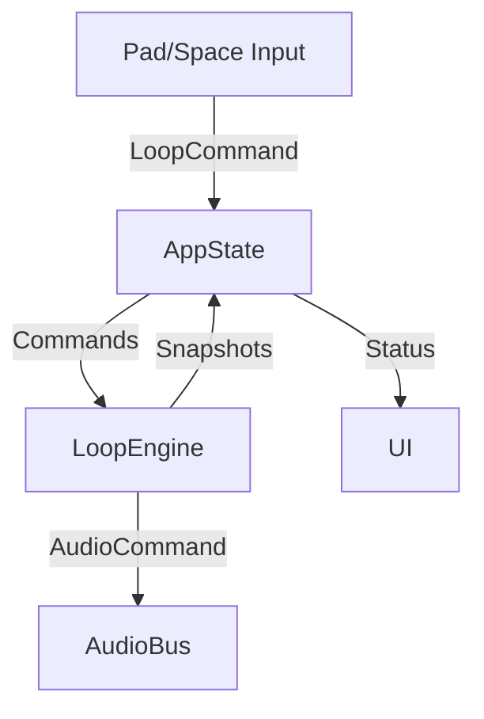

# Design – mvp-2-create-loop-layered-tracks

## Overview

Extend the loop engine so performers can overdub layered tracks onto an existing loop without stopping playback. The design expands the state machine, adds per-track storage and scheduling, and wires new transport shortcuts (pause, resume, clear) while keeping audio callbacks deterministic and low latency.

## Steering Document Alignment

### Technical Standards (tech.md)
- Reuse the Rust 2024 stack with `AppState`, `LoopEngine`, and CPAL audio pipeline per existing modules.
- Maintain ≤10 ms latency and avoid XRUns under layered overdubs by keeping audio-thread work lock-free and bounded.
- Follow spec-driven TDD: expose deterministic hooks and mockable clocks to test precise offsets.

### Project Structure (structure.md)
- Add logic to existing modules under `src/state/loop_engine.rs`, `src/app_state.rs`, `src/input.rs`, and `src/ui.rs` instead of creating new top-level directories.
- Store tests alongside existing loop engine coverage under `tests/loop_engine/` and extend e2e specs in `tests/e2e/` to validate layered overdubs.

## Code Reuse Analysis

### Existing Components to Leverage
- **LoopEngine** (`src/state/loop_engine.rs`): Extend to support overdub tracks, scheduling, and transport commands.
- **AppState** (`src/app_state.rs`): Route new commands and maintain loop metadata displayed in the UI.
- **AudioBus**/command queue: Reuse existing audio command channel for monitoring and scheduled playback.
- **Input router** (`src/input.rs`): Extend key handling for Space, Control+Space, and pad events.
- **UI transport widgets** (`src/ui.rs`): Add layered loop indicators using existing rendering patterns.

### Integration Points
- **AppState ↔ LoopEngine:** Extend the command interface with `LoopCommand::StartOverdub`, `LoopCommand::StopOverdub`, `LoopCommand::Pause`, `LoopCommand::Resume`, `LoopCommand::Clear`.
- **AppState ↔ UI:** Publish loop status snapshots that now include track count and paused state.
- **AppState ↔ Input:** Convert pad events to `LoopCommand::RecordEvent` during overdub sessions.

## Architecture

The loop engine remains the authoritative state machine. AppState mediates user input by issuing commands and reading snapshots that expose track counts for downstream consumers. The audio thread consumes scheduled play commands generated from loop tracks. All layered track data reside in LoopEngine, preserving a clean separation between input orchestration and real-time audio logic. Any UI visualizations will be handled in later phases once loop snapshots include the necessary metadata.

### Modular Design Principles
- Loop engine file keeps lifecycle logic; new structs introduced there focus on track layering.
- Introduce helper methods for serializing loop snapshots without leaking internal structures.
- UI and input modules stay thin delegators, invoking new APIs while maintaining single responsibility.



## Components and Interfaces

### LoopEngine (expanded)
- **Purpose:** Manage loop lifecycle, layered track storage, scheduling, and transport controls.
- **Interfaces:**
  - `start_overdub(pad_event: PadEvent)` → enters recording and captures first event.
  - `record_event(pad_event: PadEvent)` → appends to current overdub track.
  - `commit_overdub()` → seals recording into loop tracks.
  - `pause_loop()` / `resume_loop()` / `clear_loop()` → transport operations.
  - `snapshot()` → returns state, active tracks, and timing metadata for UI/tests.
- **Dependencies:** Clock abstraction, audio command sender, existing loop metadata.
- **Reuses:** Existing Ready/Recording/Playing transitions and scheduling infrastructure.

### LoopTrack struct (new)
- **Purpose:** Represent a single overdubbed layer with precomputed schedule offsets.
- **Interfaces:**
  - Fields: `id`, `events: Vec<LoopEvent>`, `created_at_cycle`.
  - Methods: `schedule_commands(base_cycle_start: Instant)` to enqueue play commands.
- **Dependencies:** LoopEvent struct, audio command builder.
- **Reuses:** Uses same LoopEvent structure as existing record loop feature.

### AppState loop facade
- **Purpose:** Convert user input into loop commands, persist snapshots, expose UI hooks.
- **Interfaces:**
  - `handle_pad_press(key)` → if overdub active, forward to loop engine; else start overdub.
  - `handle_space()` → branch on state for pause/resume/commit/cancel.
  - `handle_control_space()` → clear loop.
- **Dependencies:** LoopEngine, UI state structs, input context.
- **Reuses:** Existing transport handling from record-loop feature.

## Data Models

### LoopTrack
```
pub struct LoopTrack {
    pub id: TrackId,
    pub events: Vec<LoopEvent>,
    pub created_cycle: u64,
}
```

### LoopSnapshot (extended)
```
pub struct LoopSnapshot {
    pub state: LoopState,
    pub track_count: usize,
    pub is_paused: bool,
    pub cycle_position_ms: u128,
    pub active_overdub: Option<OverdubSnapshot>,
}
```

## Error Handling

### Error Scenario 1 – Audio command backpressure
- **Handling:** If the audio command channel is full, drop to error state, log via tracing, and abort overdub commit to avoid mismatched playback.
- **User Impact:** Overdub cancels, audio continues with previously committed tracks, and a warning is emitted to logs for diagnostics.

### Error Scenario 2 – Invalid state transitions
- **Handling:** Guard APIs (e.g., `start_overdub`) to return `Result` errors if called in incompatible states; AppState logs and ignores illegal input combos.
- **User Impact:** Loop state remains unchanged while the invalid action is ignored; developers can inspect debug logs to identify the misuse.

## Testing Strategy

### Unit Testing
- Extend `tests/loop_engine/loop_happy_path.rs` to cover multi-track overdub scheduling.
- Add new `loop_overdub_layers.rs` verifying precise offsets and phase alignment.
- Test pause/resume/clear transitions in loop engine unit tests.

### Integration Testing
- Extend `tests/app_state_loop.rs` to simulate pad/space/control-space sequences producing correct snapshots and transport transitions.
- Validate UI snapshot propagation through `tests/app_state_tests.rs`.

### End-to-End Testing
- Add e2e scenario `tests/e2e/loop_overdub_layers.test.ts` to simulate layering pads live, pausing, resuming, and clearing.
- Extend existing loop capture e2e to ensure metronome remains silent during overdub.

