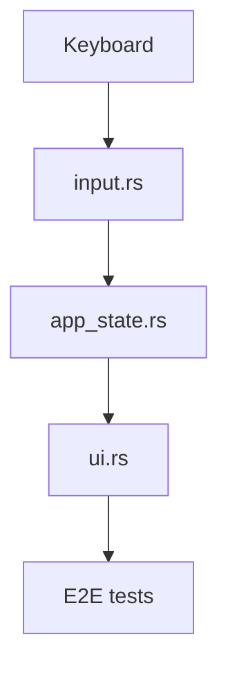

# Design – mvp-2-setup-bpm-and-loop-bars

## Overview
Implement global tempo (BPM) and loop length (bars) controls for the pads screen with a persistent summary box and an editable center popup. Keyboard-only navigation and editing, consistent visual language, and immediate state/UI updates on confirm.

## Steering Document Alignment

### Technical Standards (tech.md)
- Rust 2024, binary `termigroove`, TUI-first architecture, in-memory state.
- E2E via `@microsoft/tui-test`; tests drive binary behavior and visible text.

### Project Structure (structure.md)
- Isolate state in `src/app_state.rs` (bpm, bars).
- Render logic in `src/ui.rs` for summary box and popup.
- Input handling in `src/input.rs` for focus traversal and editing.

## Code Reuse Analysis

### Existing Components to Leverage
- `src/app_state.rs`: Extend to store and mutate `bpm` and `bars`.
- `src/ui.rs`: Extend rendering; integrate with `tui-popup` and `tui-input` widgets.

### Integration Points
- No external storage; values live in app state. UI reads from and writes to state.

## Architecture

- Central `AppState` holds `bpm: u16`, `bars: u16`, and UI mode flags:
  - `focus: FocusTarget` (`None | SummaryBox | PopupFieldBpm | PopupFieldBars | PopupOk | PopupCancel`)
  - `is_popup_open: bool`
  - `draft_bpm: String`, `draft_bars: String` (backed by `tui_input::Input` instances)
- Input loop updates `focus` and `is_popup_open` based on keys.
- UI renders summary box always; popup only when `is_popup_open`.
- Confirm updates state; cancel discards edits.

### Modular Design Principles
- Single file responsibility: state, input, and UI in separate modules.
- Keep popup/input logic encapsulated to avoid coupling.



## Crates & Widgets (explicit adoption)
- Inputs: `tui-input` (`https://docs.rs/tui-input/latest/tui_input/`)
  - Use two `tui_input::Input` instances (for BPM and Bars) to manage text, caret, and editing.
- Popup: `tui-popup` from `tui-widgets`
  - Use `tui-popup` crate (`https://crates.io/crates/tui-popup`, docs: `https://docs.rs/tui-widgets/latest/tui_widgets/`) to render a centered modal with double border.
- Rendering: Continue using the project’s TUI rendering approach; the popup and inputs are composed within `ui.rs`.

## Input Field Design (tui-input)
- Create `Input` objects when opening the popup:
  - `bpm_input: tui_input::Input` initialized with current bpm as string (`draft_bpm`).
  - `bars_input: tui_input::Input` initialized with current bars as string (`draft_bars`).
- Allowed characters: digits only (0–9). Non-digits are ignored at the event mapping layer.
- Caret behavior: left/right arrows move the caret within the active input; backspace/delete edit as expected.
- Max lengths and ranges:
  - BPM: clamp to 20..=300 on confirm; input length limited to 3.
  - Bars: clamp to 1..=256 on confirm; input length limited to 3.
- Focus traversal (looping): Up/Down cycles `bpm → bars → OK → (Down from OK goes to Cancel only via Left/Right)`, and `OK ↔ Cancel` via Left/Right.
- Confirm/Cancel semantics (per requirements):
  - Confirm: When focus is on OK and the user presses Enter ⇒ parse/clamp and apply values.
  - Cancel: When focus is on Cancel and the user presses Enter, or the user presses Esc anywhere in the popup ⇒ discard edits.

## Summary Box Design
- Placement: Top-left of the pads screen.
- Size: Height ≈ two-fifths of the screen; width sufficient for labels at left and values at right with ample spacing.
- Border/Frame: Green border consistent with pad styling; persistent (always rendered on pads screen).
- Content layout:
  - Vertical stack of two rows: `bpm:` and `bars:`.
  - Labels (`bpm:` / `bars:`) left-aligned; numbers right-aligned.
  - The horizontal gap between label and number is maximized within the box width for clear separation.
  - Elements are aligned to the top within the box.
- Visual states:
  - Normal: Green border only; internal content in calm/read-only style.
  - Focused (via arrow keys): A white rectangular outline encloses both `bpm` and `bars` elements, signaling actionability.
  - Selected (after Enter): The area inside the white outline is highlighted (active state) while the popup opens.
- Behavior:
  - Any arrow key brings focus to the summary box if not already focused.
  - Pressing Enter while focused opens the popup and anchors the user’s mental model to this box.

## Popup Design (tui-popup)
- Use a centered `tui-popup` with:
  - Frame: dark-green panel with double light border (per visual language).
  - Layout: two columns (labels left, inputs right), bottom row for `[OK] [Cancel]`.
  - The popup anchors visually to the summary box context (summary box stays rendered beneath with an active look).
- Focus styles:
  - White ring/highlight for focused element (inputs or buttons).
  - Active/pressed appearance when the popup is open (summary box darkens internally).

## Focus & Keybindings
- Global (pads screen): Any arrow key brings focus to the summary box if not already visible/focused.
- Enter on summary box: opens popup; sets focus to BPM input; initializes draft values.
- Inside popup:
  - Up/Down: traverse BPM → Bars → OK (then loop to BPM), with OK ↔ Cancel via Left/Right.
  - Left/Right: caret movement within active input; on buttons, toggles OK/Cancel.
  - Digit keys: insert into active input (digits only); non-digits ignored.
  - Backspace/Delete: edit active input.
  - Enter: if focus is OK, apply; if focus is Cancel, discard.
  - Esc: discard (regardless of focused element).

## Confirmation & Validation
- On OK:
  - Parse `draft_bpm` and `draft_bars` to `u16`.
  - Clamp BPM to 20..=300; Bars to 1..=256.
  - Update `AppState` via `set_bpm`/`set_bars`; close popup.
- On Cancel/Esc:
  - Close popup without changing `AppState`.
- UI immediately reflects new values in the summary box.

## Components and Interfaces

### State (app_state.rs)
- Purpose: Hold bpm/bars, focus, popup state, and draft inputs for popup editing.
- Interfaces:
  - `get_bpm() -> u16`, `get_bars() -> u16`
  - `set_bpm(u16)`, `set_bars(u16)`
  - `open_popup(draft_bpm, draft_bars)`, `close_popup(apply: bool)`
- Dependencies: none.

### Input (input.rs)
- Purpose: Map arrow/enter/esc keys to focus transitions and editing.
- Interfaces:
  - `handle_key(key: KeyEvent, state: &mut AppState)`
- Dependencies: `AppState` focus model, `tui_input::Input` for active field editing.

### UI (ui.rs)
- Purpose: Render summary box and center popup per focus state.
- Interfaces:
  - `render_summary_box(frame, area, &AppState)`
  - `render_popup(frame, area, &AppState)` using `tui-popup` and drawing `tui-input` contents.
- Dependencies: `AppState` values and focus flags.

## Data Models

```text
AppState {
  bpm: u16,
  bars: u16,
  is_popup_open: bool,
  focus: FocusTarget,
  draft_bpm: String,
  draft_bars: String,
}

enum FocusTarget {
  None,
  SummaryBox,
  PopupFieldBpm,
  PopupFieldBars,
  PopupOk,
  PopupCancel,
}
```

## Error Handling

### Error Scenarios
1. Non-numeric input in fields
   - Handling: ignore non-digits; clamp after parse
   - User Impact: caret moves; invalid chars do nothing

2. Overflow/empty value on confirm
   - Handling: default to previous value if parse fails; clamp to range
   - User Impact: safe, predictable results

## Testing Strategy

### Unit Testing
- State transitions: open/close popup, confirm/cancel, clamping
- Input navigation: focus traversal loops, caret behavior basics

### Integration Testing
- End-to-end focus and edit flows across summary box and popup

### End-to-End Testing
- GIVEN pads screen → arrow key shows/focuses summary box
- Enter opens popup with bpm focused and defaults shown
- Edit bpm/bars with arrows and digits
- Confirm with Enter updates UI/state; Cancel with Enter or Esc discards

## Cargo.toml Updates
- Add dependencies (versions to be pinned during implementation):
  - `tui-input`
  - `tui-popup` (from `tui-widgets`)
- Keep toolchain pinned via `rust-toolchain`; validate on macOS 14.

## Decision Log
- **2025-09-25**: Integrated `tui-popup` v0.6 for the BPM/Bars configuration modal. Wrap popup body in `PopupContent` so we can size/center via `SizedWidgetRef`. Applied double-border styling per design, ensured inputs/buttons render inside popup layout, and adjusted state to use existing focus model; no changes to business logic were required.
